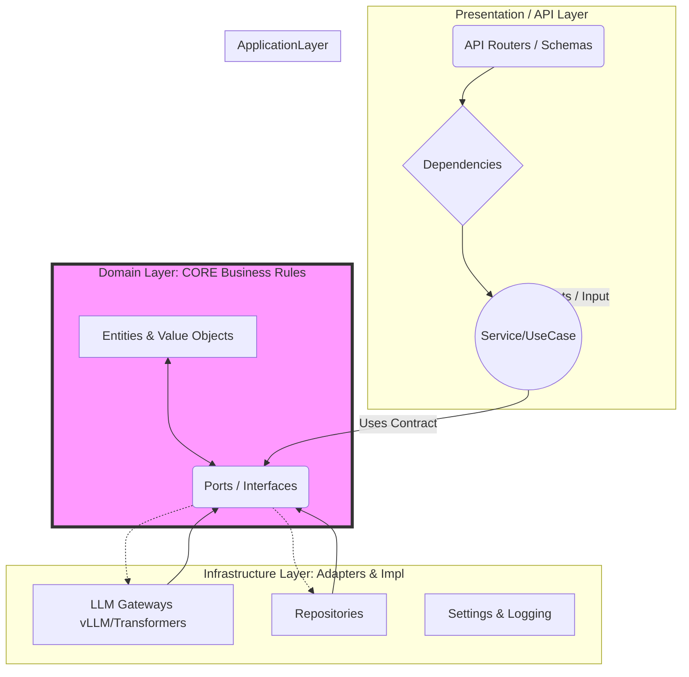

# アーキテクチャ設計書 (Architecture Document)
=========================

## 概要 (Overview)
本プロジェクトは、大規模言語モデル (LLM) を核としたサービスを提供するPythonアプリケーションです。クリーンアーキテクチャ（またはレイヤードアーキテクチャ）の原則に従い、ビジネスロジックと外部技術への依存を明確に分離して設計されています。これにより、テスト容易性の向上、メンテナンス性の確保、および将来的なモデルやインフラストラクチャの変更耐性を高めています。

## 主要な構成要素とディレクトリ構造 (Component Structure)
プロジェクトは主に `src/` ディレクトリ配下に機能ごとにレイヤー分けされています。

### 1. Domain Layer (`src/domain/`) - ビジネスルールの核
この層は、アプリケーションが「何をすべきか」という抽象的な概念を定義します。外部の技術（DB, APIなど）について一切知りません。
*   **Entities**: ビジネス上の実体 (例: `GenerationConfig`, `InferenceResult`)。
*   **Value Objects**: 不変の値やデータ構造 (例: `Message`)。
*   **Ports (Interfaces)**: 外部との接点（契約）を定義します。LLMを利用するための抽象的なインターフェースとして `ChatGateway` などがここに定義されます。

### 2. Application Layer (`src/application/`) - ユースケースの実装
ドメイン層で定義されたルールを実行する具体的な処理（ビジネスロジック）を実装する層です。
*   **Services**: 特定の業務 (例: `CompletionService`, `ModelCatalog`) を実行します。これらのサービスは、`domain/ports/` で定義されたインターフェースを受け取り、具体的な実装側（Infrastructure）に依存して処理を完結させます。

### 3. Infrastructure Layer (`src/infrastructure/`) - 外部との結合部
アプリケーションが必要とする外部の具体の実装を提供します。ここが「Port」を「Adapter（アダプタ）」に変換する役割を持ちます。
*   **Gateways**: `transformers_runtime.py`, `vllm_openai_gateway.py` など、実際にLLMを提供する外部サービスへの具体的な呼び出しロジックを実装しています。
*   **Repositories**: 永続化層の実装（インメモリなど）。
*   **Settings / Logging**: 環境設定やロギングなどの横断的なユーティリティを提供します。

### 4. Presentation/API Layer (`src/api/` & `src/presentation/`) - ユーザーインターフェースと入口
アプリケーションが外部からリクエストを受け付ける部分です。
*   **Routers / Schemas**: FastAPIなどのフレームワークのルーティング定義や、入出力データの構造（スキーマ）を定義します。
*   **Dependencies**: 各レイヤー間の依存関係の注入 (DI) が設定されていると考えられます。（`src/presentation/dependencies.py`など）

### 5. テストコード (`tests/`)
ユニットテストやインテグレーションテストが行われる場所です。

## アーキテクチャ図 (Mermaid)
以下に、このプロジェクトの層間の依存関係を示します。Markdownレンダラーがサポートしている場合は視覚化されます。

