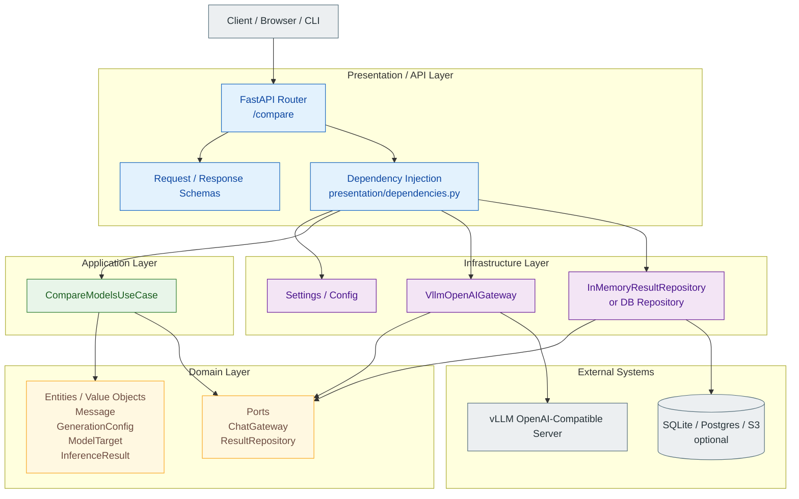
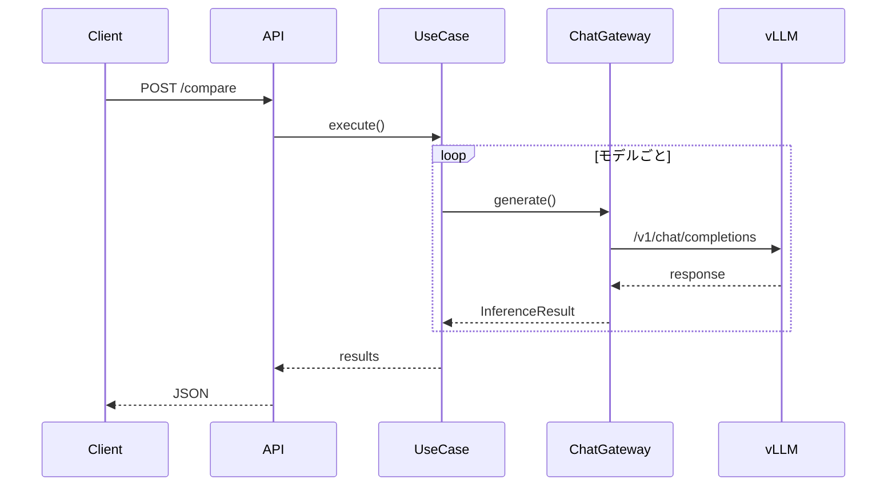

# llm_core

## WSL2 + Docker Compose で起動

Docker Desktop の WSL integration を有効にし、リポジトリを WSL2 の Linux
ファイルシステム（例: `~/src/llm_core`）に置いて実行します。NVIDIA GPU を使う
ため、ホスト側には WSL2 対応 NVIDIA ドライバーも必要です。

```bash
cp .env.example .env
docker compose build
docker compose run --rm --service-ports llm-core python src/main.py
```

Compose はプロジェクト全体を `/app` に bind mount します。そのため、WSL2 側で
編集したソースはコンテナを再ビルドせずに反映されます。依存関係を変更した場合は
`docker compose build` を再実行してください。コンテナ内のプロセスは WSL2 の
標準ユーザーとファイルを共有しやすい `app` ユーザー（UID/GID `1000`）で実行されます。

Hugging Face がダウンロードしたモデルはホストの `./models`（コンテナ内の
`/models`）に保存されます。コンテナを作り直しても再利用され、ホストからも直接
確認できます。モデルを削除する場合は `./models` 内の対象ファイルを削除してください。

Dockerfile には開発用の起動コマンドを固定していません。Compose は TTY を有効に
しているため、必要なコマンドを `docker compose run` で指定できます。

GPU を使わず CPU のみで確認する場合は、`compose.yml` の `gpus: all` を削除して
起動してください。

## レイヤーごとの責務

### Domain
業務ルールを持つビジネスロジックの中心
- 比較対象モデル
- メッセージ
- 生成パラメータ

### Application
ユースケース層
- 同じプロンプトを複数モデルに送る
- 結果を整形する
- 

## Infrastructure
外部依存を実装する層です。
- vLLM OpenAI 互換 API 呼び出し
- DB保存
- ログ出力
- 設定読み込み

## API/Presentation
HTTPリクエストの入出力の変換

### `/v1/chat/completions`

`POST /v1/chat/completions` は OpenAI Chat Completions と同じ基本的なメッセージ形式を受け取ります。

```json
{
  "model": "gemma",
  "messages": [
    {"role": "system", "content": "簡潔に回答してください。"},
    {"role": "user", "content": "富士山の高さは？"}
  ],
  "max_tokens": 256,
  "temperature": 0.2,
  "top_p": 1.0
}
```

レスポンスも `chat.completion` の形式で、`choices` とトークンの `usage` を返します。
`model` には `/models` の `family` または `model_name` を指定できます。


## 全体像


## シーケンスのイメージ

